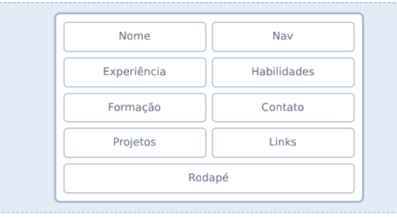

<div align="center">

# 🚀 Curriculo Web

**Template de currículo moderno e atualizado**

    

  

[Demo](#-demo) • [Funcionalidades](#-funcionalidades) • [Como rodar](#-como-rodar-o-projeto) • [Contribuindo](#-contribuindo) • [Contato](#-contato)

</div>

---

## 📖 Sobre o projeto

Este projeto busca atender à trilha de estudos Full stack que estou realizando. A sugestão do projeto é criar um curriculo web completo e responsivo. Utilizando HTML Semântico e também utilizando CSS.

O objetivo é consolidar o aprendizado em programação e criar um repositório de projetos autorais, sem uso de Ia no seu desenvolvimento e sem cópia de projetos realizados em cursos da internet.

---

## 🎬 Demo

> Uma imagem vale mais que mil linhas de código.

Design Proposto:


Projeto Final:


🔗 **Ao vivo:** [seu-projeto.com](https://seu-projeto.com)

---

## 🛠️ Tecnologias utilizadas

| Tecnologia | Para que serve no projeto |
| --- | --- |
| **HTML5** | Estrutura e semântica das páginas |
| **CSS3** | Estilização, layout e responsividade |
| **Git & GitHub** | Versionamento e hospedagem do código |

---

## 📁 Estrutura de pastas

```
fe_surriculo_web/
├── assets/          # Imagens, ícones e fontes
├── css/
│   └── style.css    # Estilos
├── index.html       # Página principal
└── README.md        # Você está aqui 👋
```

---

## ⚙️ Como rodar o projeto

### Pré-requisitos

Antes de começar, você vai precisar de:

- [Git](https://git-scm.com/) instalado
- Um navegador moderno (Chrome, Firefox, Edge...)
- Um editor de código, como o [VS Code](https://code.visualstudio.com/)

### Passo a passo

```bash
# 1. Clone o repositório
git clone https://github.com/pratesddev/fe_curriculo_web.git

# 2. Entre na pasta do projeto
cd fe_curriculo_web

# 3. Abra o index.html no navegador
# (ou use a extensão Live Server do VS Code)
```

Pronto! Se deu tudo certo, o projeto já está rodando na sua máquina. 🎉

---

## 🗺️ Roadmap

- [ ] Ideia e planejamento
- [ ] Versão inicial
- [ ] Melhorias de responsividade
- [ ] Modo escuro
- [ ] Novas funcionalidades

---

## 🤝 Contribuindo

Contribuições são super bem-vindas! Quer ajudar? É só seguir:

1. Faça um **fork** do projeto
2. Crie uma branch para sua feature: `git switch -c minha-feature`
3. Faça suas alterações e o commit: `git commit -m "Adiciona minha feature"`
4. Envie para o seu fork: `git push origin minha-feature`
5. Abra um **Pull Request** 🚀

Encontrou um bug ou tem uma ideia? Abra uma [issue](https://github.com/pratesddev/fe_curriculo_web/issues), sem cerimônia.

---

## 📄 Licença

Este projeto está sob a licença **MIT**. Isso significa que você pode usar, copiar e modificar à vontade. Veja o arquivo [LICENSE](./LICENSE) para mais detalhes.

---

## 👤 Autor

Diego Prates

[](https://github.com/pratesddev)
[](https://linkedin.com/in/prates-diego)
[](mailto:dmoprates1@gmail.com)

---

<div align="center">

Feito com ☕ e muito código.

⭐ Se o projeto te ajudou, deixa uma estrelinha no repositório!

</div>